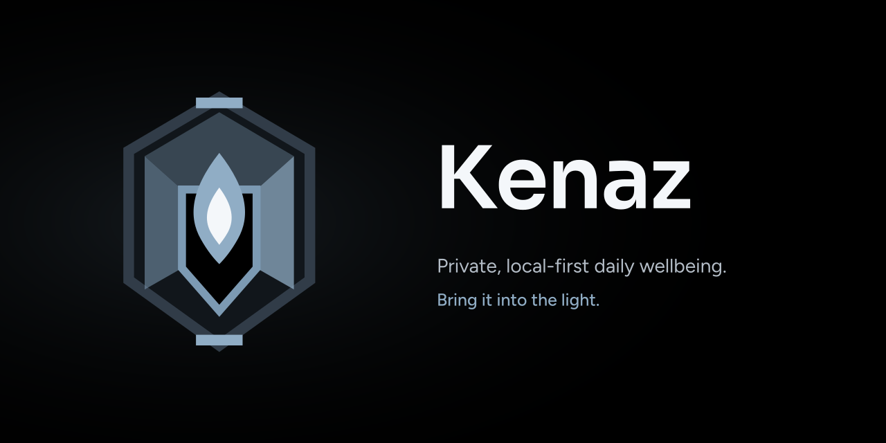

# Kenaz

A private, local-first daily wellbeing check-in: log mood, energy, and sleep, and see your patterns over time. *Bring it into the light.*

## Install

Open **[malinfossum.github.io/kenaz](https://malinfossum.github.io/kenaz/)** on your phone, then choose *Install app* (or *Add to Home screen*). It runs standalone and works offline — there is no account, no server, and nothing to sign up for.

## What it does

Check in for the day with mood, energy, sleep and a note — each one optional. Today's entry sits against your last seven days with a gentle streak. A weekly review surfaces your brightest and hardest day, plus a small sleep–mood pattern once there is enough data to say anything honest. History is browsable and editable.

## Your data

Everything is stored in IndexedDB on your own device. Nothing is sent anywhere — the app makes no network calls once it has loaded.

Export writes all your check-ins to a JSON file; import merges one back in, with the more recently edited entry winning so a restore never overwrites newer changes. That file is your only backup: if the device is lost or its storage is cleared, the data goes with it. The export is plain, unencrypted JSON, so keep it somewhere private.

## The name

**Kenaz** (pronounced *KEN-ahz*) is the Elder Futhark rune for *torch* — *to spark, to bring into the light.* It's from the runic alphabet of the early Norse and Germanic peoples, the same lineage the Vikings later carved into weapons, monuments, and amulets. In Norwegian: *å tenne, å bringe frem i lyset.*

Kenaz is the fire-family sibling to [Ignite](https://github.com/malinfossum/ignite), my local-first ADHD task PWA: where Ignite is *a small flame, kept going*, Kenaz is the torch you hold up to see your week clearly. Hence the tagline.

To me, Kenaz is about consistency, reflection, and the self-care that lets you become a better version of yourself and put your energy where it counts. Coming from social work — and living with ADHD — I've learned you can't pour from an empty cup: put on your own oxygen mask first, then help the person next to you. The Norwegian words I live by — *egensikkerhet*, *egenomsorg*, *ta vare på deg selv*, *bruk energi på det som betyr noe og som gir noe tilbake* — are the values this tool is built around.

## The mark

The **Lantern**: a faceted frame protecting a private reflection, with a flame at its centre that reveals patterns without judging them. A light you hold up to understand your week.

Assets, colours, and usage notes live in [`docs/brand/`](docs/brand/README.md).

## Foundations

The app grew out of a C# solution that still lives here and remains the base for a planned native desktop version.

- `Kenaz.Core` — domain model, rules, and insights. No `Console`; file IO is isolated to the storage adapters behind a repository interface.
- `Kenaz.Console` — console front-end over `Kenaz.Core`, with its own SQLite store at `%APPDATA%\Kenaz\checkins.db`.
- `Kenaz.Api` — loopback-only HTTP API over the same check-ins, bound to `127.0.0.1` and guarded by a bearer token.
- `Kenaz.Tests` — NUnit.

```powershell
dotnet build Kenaz.slnx
dotnet test Kenaz.slnx
dotnet run --project Kenaz.Console
```

The console app can export its check-ins as JSON in the same format the web app imports, which is how existing data moves onto a phone.

## Development

The app is vanilla JavaScript on an MVC split, built with Vite. Styling comes from a shared design-system consumed as a read-only folder under `Kenaz.Web/public/design-system` — edit it upstream, never here.

```bash
cd Kenaz.Web
npm install
npm run dev
npm test
npm run build
```

## Licence

Apache License 2.0 — see [LICENSE](LICENSE).
